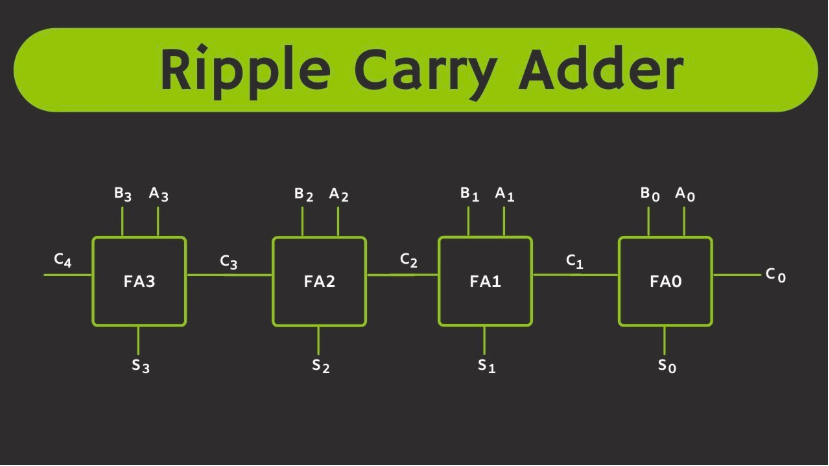
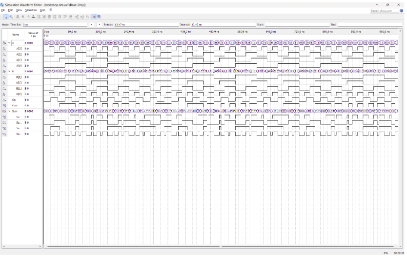

# 4-BIT RIPPLE CARRY ADDER

#### Name:- Jaiyantan S 
#### Reg_no:- 212224100021
#### Question:- 4-BIT-RIPPLE-CARRY-ADDER

### AIM:

To implement a 4-bit Ripple Carry Adder using Verilog and validate its functionality by observing the sum and carry-out values.


### SOFTWARE REQUIRED:

- Quartus Prime or any Verilog simulation tool (e.g., ModelSim, Vivado).


### THEORY:

A 4-bit Ripple Carry Adder consists of a series of full adders where the carry-out of one adder is used as the carry-in for the next. This cascading effect of carries is why it’s called a "ripple" carry adder. The full adder logic is as follows:

- **Sum** = A ⊕ B ⊕ Cin
- **Carry** = (A ⋅ B) + (Cin ⋅ (A ⊕ B))

In the design, A and B are 4-bit binary numbers, and **Cin** is the carry-in to the least significant bit (LSB). The adder produces a 4-bit Sum and a **Carry-out** from the most significant bit (MSB).

### CIRCUIT DIAGRAM:



### PROCEDURE:

- Set up the Verilog environment (e.g., **Quartus**).
- Write the Verilog code for a **Full Adder** module.
- Use Full Adders to construct the **4-bit Ripple Carry Adder**.
- Simulate the design using a **testbench** to validate the outputs.


### PROGRAM:

```
// Verilog code for the 4-bit Ripple Carry Adder
module workshop (
    input [3:0] A, B,      // 4-bit Inputs: A and B
    input Cin,             // Carry-in
    output [3:0] Sum,      // 4-bit Sum output
    output Cout            // Carry-out
);

    wire C1, C2, C3;       // Internal carry wires

    // Instantiate 4 full adders
    full_adder FA0 (A[0], B[0], Cin, Sum[0], C1);  // Least significant bit (LSB)
    full_adder FA1 (A[1], B[1], C1, Sum[1], C2);
    full_adder FA2 (A[2], B[2], C2, Sum[2], C3);
    full_adder FA3 (A[3], B[3], C3, Sum[3], Cout); // Most significant bit (MSB)

endmodule 

// Full Adder Module
module full_adder (
    input A, B, Cin,       // Inputs: A, B, and Carry-in
    output Sum, Cout       // Outputs: Sum and Carry-out
);

    assign Sum = A ^ B ^ Cin;            // Sum = A ⊕ B ⊕ Cin
    assign Cout = (A & B) | (Cin & (A ^ B)); // Cout = (A ⋅ B) + (Cin ⋅ (A ⊕ B))

endmodule
```

### RTL Schematic


### Output Timing Waveform




### RESULTS:

The Ripple Carry Adder was successfully implemented in Verilog. The simulation results showed the correct sum and carry-out values for various input combinations, confirming the functionality of the design.

